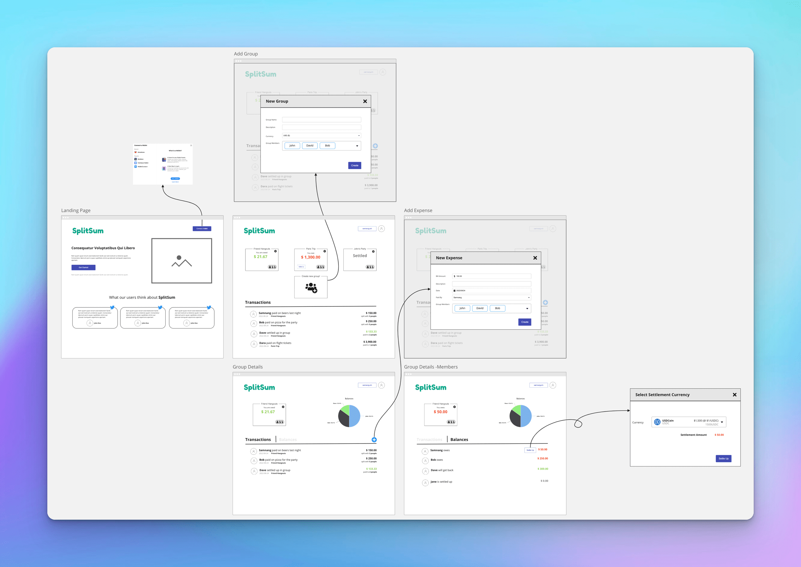

# SplitSum - Frontend

Split expenses with friends when you go hangouts or your holiday trips.

  

## Development server

Run `ng serve` for a dev server. Navigate to `http://localhost:4200/`. The application will automatically reload if you change any of the source files.

## Contributors

We love pull requests from everyone.

- [Samnang Chhun](https://github.com/samnang)
- [Alphonso Miguel T. Balagtas](https://github.com/phonsoswag)
- [Sereyboth Chamroeun](https://github.com/ch-sereyboth)

## License

The software is available as open source under the terms of the [MIT License](http://opensource.org/licenses/MIT).
